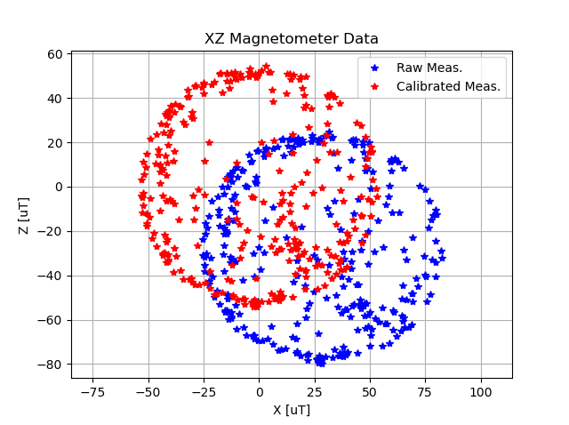

# Calibrating 3-Axis Magnetometers

Code By: Michael Wrona

YouTube: [MicWro Engr](https://www.youtube.com/channel/UCIeZzuXHGm7zqSFvT8xGoIQ)

Blog: [mwrona.com](https://mwrona.com/)

This repository explains a general procedure to calibrate 3-axis mangetometer sensors. I will use an Arduino to read magnetometer data from an I2C sensor, transmit it over serial to a PC, log the data to a text file, and generate calibration parameters with a software named Magneto.

Example data can be found in the `examples` folder.

## Magneto Magnetometer Calibration Software

I used Magneto to calibrate my magnetometer. This is a great piece of software created by the user behind [sailboatinstruments.com](http://sailboatinstruments.blogspot.com/). I take no credit for the creation of this software.

[Magneto can be downloaded at this link.](https://sites.google.com/site/sailboatinstruments1/home)

## What are Magnetometers?

Before explaining the calibration procedure, it would be good to review what magnetometers are and what they measure. Magnetometers are basically 3D compasses - they are used to determine earth's magnetic field vector and therefore compass heading relative to magnetic north. They consist of three individual magnetic flux sensors arranged orthogonal to each other to form a triad. Magnetometers are used in many applications across many fields, particularly in aerial systems. Magnetometers are used whenever heading needs to be known. They are very important navigation sensors in boats, multirotor drones, airplanes, fighter jets, missiles, rockets, and spacecraft. Magnetometer calibration errors are frequently the source of UAV navigation errors and crashes, so careful attention must be given to calibration (if you know, you know).

# Calibration Procedure

## Step 1: Output Comma-Separated Data to Serial Port

The first step is to read data from your magnetometer and output it to a serial connection to your computer. I used [Adafruit's FXOS8700 + FXAS21002 9-DOF IMU](https://www.adafruit.com/product/3463). The Arduino sketch I used to get my readings can be found in the `output-mag-data` folder. Your code will de different depending on what sensor you have, and the one I wrote will only work with my sensor. You should write your own code to output comma-separated magnetometer readings to a serial port.

## Step 2: Write Data to Tab-Delilimited Text File

Once you can output comma-separated data to a serial port to you computer, you can use `log-mag-readings.py` to read the serial data. My code will output readings to a tab-delimited file, which is required by Magneto. Be sure to change the file name, sample period, and reading duration at the top of the file.

Once the code begins running, rotate your sensor around in various orientations to make sure you measure earth's magnetic field at many sensor orientations.

## Step 3: Determine Local Magnetic Field Strength

Magneto requires the norm of earth's magnetic field at the calibration location. You can use [NOAA's World Magnetic Model 2020](https://www.ngdc.noaa.gov/geomag/WMM/calculators.shtml) calculator to do this. Simply input you latitude, longitude, and elevation above mean sea level, and record the `Total Field` parameter. Make sure the units match your magnetometer's measurement units.

## Step 4: Run Magneto

Once you have a tab-delimited text file of raw magnetometer readings and the local magnetic field strength, you are ready to run Magneto. Simply load your data file, type in the field strength, and click calibrate! BAM, you have you calibration parameters!

## Step 5: Compare Uncalibrated and Calibrated Measurements

You can compare you calibrated and uncalibrated measurements by running `plot-calibration-data.py`. Be sure to input your calibration parameters and change the filename at the top of the code. A series of Matplotlib plots will appear.

## Resources

* [Magneto calibration software](https://sites.google.com/site/sailboatinstruments1/home)
* [World Magnetic Model 2020 Calculator](https://www.ngdc.noaa.gov/geomag/WMM/calculators.shtml)
* [Paramagnetism - Wikipedia](https://en.wikipedia.org/wiki/Paramagnetism)
* [Magnetometer - Wikipedia](https://en.wikipedia.org/wiki/Magnetometer)
* [Magnetometer Errors and Calibration - VectorNav](https://www.vectornav.com/resources/magnetometer-errors-calibration)
